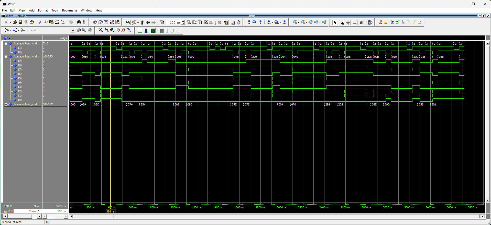

**template-somadorpf-vhdl**

# Tutorial: Implementação de Somador Ponto Flutuante na DE10-Lite

**Autores:** Alex de Marins Malta, Renato Sassaqui Moreira

**Disciplina:** Sistemas Digitais Q2.2026

**Data:** 31/07/2026

---

## 1. Objetivo do Projeto
Este projeto adapta o somador de ponto flutuante simplificado (13 bits) do livro-texto para a placa Terasic DE10-Lite (MAX 10). O objetivo é demonstrar a síntese lógica e a simulação de hardware usando VHDL.

## 2. Descrição gráfica do funcionamento do sistema
    Usar os elementos necessários para descrever o fucnionamento, isto é, tabelas verdade, diagramas de estados, etc.
    Usar as variáveis de entrada e saída especificadas no VHDL.


*****//TODO*****

## 3. Adaptações de Hardware (DE10-Lite)

```
Indicar o que a arquitetura original usava e quais mudanças foram feitas para a implementação na placa

**O que mudamos no VHDL original:**
* Removemos...
* Roteamos ...
* Reorganizamos ...

**Descrição gráfica do sistema**
* Caso mudar a descrição gráfica feita no item 2, atualizar aqui.
* Usar as variáveis de entrada e saída especificadas no VHDL.
```

**O que mudamos no VHDL original:**

A lógica original do somador de ponto flutuante, descrita em [prototipos/fp_adder.vhd](prototipos/fp_adder.vhd), foi preservada na implementação adaptada em [somadorFloat.vhd](somadorFloat.vhd). A estrutura do algoritmo permaneceu a mesma, incluindo as etapas de ordenação, alinhamento, soma/subtração e normalização.

A principal mudança consistiu na adaptação da arquitetura para uma interface com a placa DE10-Lite. O circuito combinacional original passou a operar como um sistema controlado por estados, permitindo a entrada de dados por meio de chaves e botões e a exibição do resultado em LEDs.

O sistema opera em três estados principais:

- **S_LER_N1:** leitura do primeiro número;
- **S_LER_N2:** leitura do segundo número;
- **S_RESULTADO:** exibição do resultado.

Os valores são inseridos por meio dos switches `SW`, enquanto os resultados são apresentados nos LEDs. O botão `KEY0` avança para o próximo estado, e o botão `KEY1` reinicia o fluxo para o estado inicial. O formato de entrada utilizado foi definido como:

`sinal[1] | expoente[4] | mantissa[5]`


## 4. Evidências de Validação

### Simulação 
A validação foi realizada por meio de simulação no ambiente Questa, onde foram observados os resultados das operações para diferentes entradas. A imagem abaixo mostra um exemplo do comportamento do circuito durante a execução do teste.
.



Na imagem, o cursor amarelo destaca o resultado exibido nos LEDs após a inserção de dois valores de entrada. Para facilitar a análise dos resultados, foram gerados logs formatados, disponíveis em [docs/logs_tb_v0.txt](docs/logs_tb_v0.txt).

Vale destacar que a representação em formato decimal apresentada nos testes tem apenas finalidade visual. Devido à limitação da mantissa em 5 bits, algumas operações apresentam arredondamento ou perda de precisão, embora a operação binária tenha ocorrido conforme o esperado.


### Código VHDL Final 
```vhdl
-- Insira aqui o VHDL final e faça ênfase nos trechos de código mais importantes da sua adaptação, isto é, eles devem estar claramente identificados.
```

***[DISPONÍVEL NESTE LINK](somadorFloat.vhd)***


### Funcionamento na Placa
Abaixo, imagens do funcionamento na Placa para 4 casos.

*Etapa 4 (considerando qeu a Etapa 4 considera toda a documentação em si)*

## 5. Diário de Bordo de IA 


    Utilizamos o [ChatGPT/Claude/Gemini] para auxiliar na geração do Testbench e na refatoração do código. Abaixo está a análise crítica do uso da ferramenta.

    **Prompts Utilizados:**
    > "Insira aqui o prompt exato que você usou..."

    **O Erro da IA (Alucinação):**
    > Descreva aqui o que a IA errou (ex: tentou usar pinos inexistentes, criou clock em testbench de circuito combinacional, etc).

    **A Correção Humana:**
    > Como você corrigiu o código gerado para que ele funcionasse na nossa placa e na simulação.

Utilizamos o Gemini e o Copilot (para VS Code) para auxiliar na geração do testbench e na refatoração do código. A seguir, apresentamos uma análise crítica do uso dessas ferramentas.

***Pré-projeto:***

> (Gemini)  
> "Traduza o PDF anexo para português do Brasil."

**Arquivo anexo:** [📄 Projeto_Final_Sistemas_Digitais_2026_Q2.pdf](docs\Projeto_Final_Sistemas_Digitais_2026_Q2.pdf)  
**Arquivo gerado:** [📄 Projeto_Final_Sistemas_Digitais_2026_Q2_PTBR.pdf](docs\Projeto_Final_Sistemas_Digitais_2026_Q2_PTBR.pdf)

O resultado foi além do esperado: além de traduzir o conteúdo, a ferramenta também formatou o texto, incluindo highlights em trechos de código.
Os programas [📄 fp_adder.vhd](prototipos\fp_adder.vhd) e [📄 fp_adder_test.vhd](prototipos\fp_adder_test.vhd), descritos no PDF, foram salvos na pasta [📂 prototipos](prototipos) deste projeto.

> (Gemini)  
> "Escreva um somador de números naturais em VHDL para uma placa DE10-Lite. O sistema deve funcionar em 3 estados: um para registrar o primeiro número, outro para o segundo e outro para exibir o resultado. O botão A deve avançar para o próximo estado, e o botão B deve resetar, retornando ao primeiro estado. Em cada estado, o número correspondente deve ser exibido nos displays de 7 segmentos."

A proposta foi gerar um protótipo base para compreender a implementação da máquina de estados com padrões comuns de VHDL, além de obter insights para a aplicação no sistema final.

A compilação apontou alguns erros de sintaxe, que foram corrigidos sem grandes dificuldades. O programa foi testado e adaptado em laboratório com uma placa DE10-Lite, funcionando dentro do esperado. A lógica de estados foi então utilizada na concepção da versão inicial do somador de ponto flutuante.

Com o testbench foi semelhante. O programa de testes gerado exibe logs no console do Questa, o que também se mostrou útil para os próximos testbenches, em complemento ao diagrama de ondas.

Os arquivos [📄 somadorNat.vhd](prototipos\somadorNat.vhd) e [📄 somadorNat_test.vhd](prototipos\somadorNat_test.vhd) foram salvos na pasta [📂 prototipos](prototipos).

***Versão inicial:***

A primeira versão do somador de ponto flutuante para a DE10-Lite foi adaptada a partir do programa original fornecido para o projeto, desenvolvido no VS Code com revisão do Copilot. O apoio da ferramenta concentrou-se na revisão geral do código, na correção de erros sintáticos e na inclusão de comentários que descrevem melhor o funcionamento do sistema.

Uma das sugestões propostas pela IA foi implementar o controle de estados com base em clock e ajustar os botões para evitar o efeito de *bouncing*. Embora essa ideia fosse tecnicamente plausível, ela foi descartada para priorizar a simplicidade da implementação.

A maior vantagem observada esteve na geração do testbench. Com o auxílio da IA, foi possível incluir logs claros, utilizando bibliotecas que exigiriam maior domínio da linguagem, além de economizar tempo na criação de casos de teste, o que facilitou a análise dos resultados.


## 6. Contribuição dos participantes
Utilize a taxonomia CRediT, seguem exemplos:
 * [Nome do Aluno 1], Administração do Projeto, Desenvolvimento, implementação e teste de software, Análise Formal
 * [Nome do Aluno 2], Validação de dados e experimentos
 * [Nome do Aluno 3], Redação do manuscrito original, Validação de dados e experimentos
